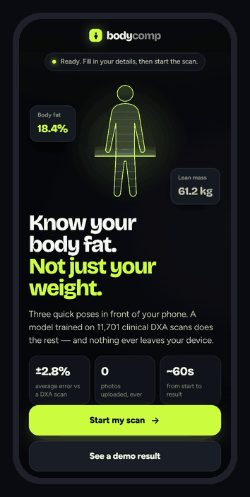
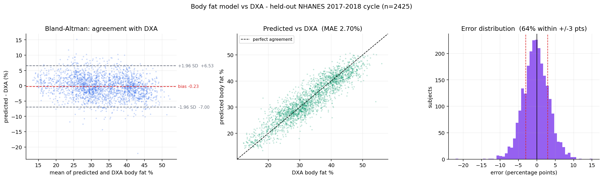

# Body Composition from Two Photos

Estimates **body fat %** and **lean mass** from a front and side photo, validated
against real **DXA scans**. Everything runs on the device — no upload, no API.

<p align="center">
  
</p>
<p align="center"><sub>Demo recorded from the real app using its built-in sample body — a real BodyM subject with
known tape measurements. Live camera capture isn't shown. <a href="https://rishabcv-eng.github.io/bodycomp/">Try it live →</a></sub></p>

**2.84% mean absolute error against clinical DXA** in good conditions, 2.96% in
harder ones — at or below the best tape-measure formula (3.16%), without the tape.

```
photo pair ──▶ segmentation ──▶ Stage 1 ──▶ circumferences ──▶ Stage 2 ──▶ body fat %, lean mass
                                (BodyM)                        (NHANES DXA)      + 80% intervals
```

| | |
|---|---|
| **Body fat, end to end** | 2.84% MAE vs DXA |
| **Waist from silhouette** | 1.97 cm MAE |
| **Interval coverage** | 80.5% (claimed 80%) |
| **Model size / latency** | 1.4 MB, ~16 ms in-browser |
| **Training data** | 11,701 DXA scans, 2,018 scanned bodies |



### What makes it worth reading

- **Deployment splits, never random.** Headline numbers hold out the entire
  2017–2018 NHANES cycle.
- **The intervals were lying, and I caught it.** Quantile regression claimed 80%
  coverage and delivered 65.6%. Conformal calibration fixed it to 80.5%.
- **IoU is the wrong metric for segmentation here.** A 0.90-IoU soft matte was
  harmless; a 0.92-IoU dilated mask was the worst case measured. Direction of
  error beats magnitude.
- **Python and JavaScript agree exactly.** 440 predictions bit-identical, 906
  feature values to 4.6e-13 — asserted in CI, not assumed.
- **Limitations are measured, not hidden.** A generalisation gap on the harder
  test set, a ~1.4 point bias for people of Asian descent, and clothing
  (a normal t-shirt adds ~5 cm to the waist).

### Run it

```bash
cd app && npm install && npm start     # http://localhost:8742
```

```bash
pip install -r requirements.txt        # Python side: training and evaluation
```

No camera? The app has a **Run a sample body** button — a real BodyM subject with
known tape measurements, so the output is shown beside the right answer.

## The app

`app/` is a web app that runs the whole pipeline **on the device** — no upload, no
API, no account. Details first, then a guided capture that confirms each position
(front, side, optional second side) before moving on; photo upload stays as a
fallback.

```bash
cd app && npm install && npm start   # http://localhost:8742
```

Chosen as a web app because it runs on any phone from a link, which is what a
demo needs. The inference core is plain ES modules with no framework and no
dependencies, so it ports to React Native or Flutter unchanged.

**11 models, 1.4 MB, ~16 ms inference.** After the scan it also produces a
training and nutrition plan — and that is where measuring body composition pays
off: with fat-free mass known, calories come from **Katch-McArdle** (lean tissue)
rather than a weight-only formula. Two people at 72.5 kg and 178 cm get 2710 vs
2273 kcal depending on how much of that weight is muscle; a weight-only formula
cannot tell them apart. Safety floors, deficit caps and referral flags are tested,
not assumed. The deployed models are deliberately
smaller than the research ones: Stage 2 at 250 trees × 15 leaves is 10× smaller
*and slightly more accurate* than 1200 × 31, because the big model was overfit.

**Parity is tested, not assumed** — porting a model to a second language silently
is how wrong numbers ship:

| Test | Scope | Worst disagreement |
|---|---|---|
| `parity_test.mjs` | 440 predictions, all 11 models | **0.0** (exact) |
| `parity_silhouette.mjs` | 906 feature values, 6 mask pairs | 4.6e-13 |
| `selftest.html` | full pipeline + multi-frame median | exact on all 11 values |
| `scan_score_test.mjs` | frame scoring, alignment gate | 15 checks pass |
| `scan_steps_test.mjs` | stepped capture state machine | 18 checks pass |
| `overlay_test.mjs` | contour, mesh and chord geometry | 26 checks pass |
| `plan_test.mjs` | plan maths and safety floors | 30 checks pass |
| `progress_test.mjs` | history, crew board, goals, ranking | 61 checks pass |
| `boot_test.mjs` | lazy model loading, retry after failure | 10 checks pass |

### A bug worth keeping

Swapping the heavy pose model for the lite one to save 25 MB raised its reported
landmark confidence, which quietly let a photo through that Python had rejected —
and the app returned a **123.6 cm hip for a slim subject**. Tuned thresholds had
silently stopped protecting anything.

The fix does not depend on landmark confidence at all: compare where the pose says
the body ends against where the mask actually ends. If the silhouette stops well
above the ankles, it has lost the legs. Both implementations now carry the check
and both reject the photo.


## Closing the generalisation gap with augmentation

The honest weakness of the first build: Stage 1 beat the height-and-weight baseline
by 41% on testA but only **3% on testB** — different subjects, harder conditions.
The model leaned on clean capture.

The fix came from an earlier measurement. `reports/mask_robustness.csv` had already
established *which* mask defects cost accuracy at inference; `src/augmented_stage1.py`
trains on those same defects — dilation, erosion, boundary noise, a mis-thresholded
matte — so the model meets imperfect masks during fitting instead of first meeting
one in the wild. Test splits stay clean, so the comparison is like for like.

| testB (400 subjects) | clean-only | + augmented | |
|---|---|---|---|
| Waist | 3.245 | **3.033** | −0.213 cm |
| Hip | 2.226 | **2.108** | −0.119 cm |
| Chest | 2.760 | **2.675** | −0.085 cm |
| Thigh | 1.702 | **1.586** | −0.117 cm |
| Upper arm | 1.226 | **1.220** | −0.006 cm |

**Every measurement improved on the harder split**, and four of five on testA too
(waist there cost +0.05 cm — the one trade).

Retrained at full size, the gap narrows further: waist on testB goes from 3.18 cm to
**2.95 cm**, turning a 3% gain over baseline into **10.4%**. Hip improves from 11% to
**21%**, thigh to **17%**.

What it does *not* do is move the end-to-end body-fat number much (2.82% → 2.84% on
testA): Stage 2's own error dominates once measurements are this close. Better
measurements are still worth having — they are what the plan, the ranking and the
trend are built on — but the honest summary is that this fixed Stage 1's weakest
result, not the headline. The shipped app uses these models.

## Loading in the order the user arrives

Measuring the boot rather than assuming it: the app fetched **24 MB and stood
four WebAssembly runtimes up before anything on screen worked** — and the
largest single file, a 15.6 MB segmenter, downloaded *first*, despite not being
needed until a scan is over a minute or more later.

The assets now load in three groups, each fetched on first use:

| Group | Size | First needed |
|---|---|---|
| `predict` | **0.97 MB** gzipped | immediately — the .bin models answer on their own |
| `preview` | ~9 MB | opening the camera |
| `measure` | ~15 MB | after the last position is captured |

Only the first blocks the app. The other two start downloading when the user
moves to the capture screen, which buys them the time it takes to read the
instructions and stand up — and someone who only wants the demo result **never
downloads the segmentation models at all**, yet gets the same 34.1% answer.

Reordering alone was not enough, and only deploying it showed why. Measured on
the live site, time to a usable app:

| | Before | After reordering | After parallelising |
|---|---|---|---|
| Bytes to first usable | 24 MB | 0.97 MB | 0.97 MB |
| Time to first usable | ~16 s | 6.3 s | **0.46 s** |

Cutting 24 MB to 0.97 MB still left 6.3 seconds, because those 30 requests were
almost entirely **serial**: `loadModels` awaited each of the eleven `.bin` files
in turn, one round trip each. They are independent files behind one manifest, so
they now load together — all eleven start within 1 ms of each other. Three more
sequential gates went with it: an independent ranking table awaited behind the
models, a three-level module graph the browser discovered one level per round
trip (fixed with `modulepreload`), and a 39 KB MediaPipe wrapper that had to
parse before `app.js` ran at all, now a dynamic import.

Localhost reported 100 ms throughout and hid every one of these. The lesson
worth keeping is that a local dev server is a bad proxy for a phone: it has no
round-trip latency, which is exactly what the bug was made of.

The subtle part is not the laziness but the memoisation. The cached promise must
be shared — four callers must not each start the same 15 MB download — while a
cached *rejection* would be a bug: a warm-up that happened to run during a
network blip would hand every later caller the same failure forever and leave
the camera broken until a reload. `boot_test.mjs` asserts both halves.

One honest footnote: Chrome statically resolves the dynamic `import()` and
speculatively fetches that 39 KB wrapper anyway, even on the demo path. The
segmentation models — the 24 MB that mattered — are genuinely never requested.

## A leaderboard that costs no privacy

A shared leaderboard needs accounts, a server and a database of other people's body
composition — which would destroy this app's one real property, that nothing ever
leaves the device.

So the comparison group is the population the models were trained against:
**11,494 adults with real DXA scans**. Percentile curves by sex and age band ship
as a 9 KB file and the lookup runs on-device, giving *"Leaner than 76% of women
aged 30-39"* at zero privacy cost.

Alongside it: scan history and a trend chart, a **weekly** streak (body composition
doesn't move day to day), badges for showing up and for direction of travel, and a
share card drawn on-device that carries the accuracy claim and the "not a medical
device" line with it. All in `localStorage`, deletable in one tap.

## Clothing is the biggest practical limit

The silhouette is the measurement, so fabric standing off the body is read as body.
Simulated on 400 pairs from 83 unseen subjects (`src/clothing_effect.py`):

| Fabric standoff | Waist bias | Body fat shift |
|---|---|---|
| Skin-tight | +0.97 cm | — |
| Fitted t-shirt (0.5 cm) | +2.89 cm | +0.74 pts |
| **Normal t-shirt (1 cm)** | **+5.10 cm** | **+1.64 pts** |
| Loose hoodie (2–3 cm) | +8.72 to +11.60 cm | +2.96 to +3.91 pts |

**~+1.6 body-fat points per cm of standoff.** A normal t-shirt nearly triples waist
error (1.91 → 5.18 cm MAE). The error only ever points one way — clothing makes you
read fatter — so it is a bias that frame averaging cannot remove. The app requires
fitted clothing up front rather than discovering the problem afterwards.

## Data

NHANES 2011–2018, four cycles, 11,701 adults aged 18–59 after filtering.
Ground truth is whole-body DXA (`DXDTOPF`), the clinical reference standard.
Hip circumference exists only in 2017–2018, so it is excluded from the main model.

## Running it

```bash
# Stage 2 - NHANES / DXA
bash src/download_nhanes.sh          # 12 files from CDC
python src/build_dataset.py          # merge + filter -> 11,701 adults
python src/train.py                  # baselines, models, fairness audit
python src/calibrate_and_export.py   # conformal calibration

# Stage 1 - BodyM silhouettes
python src/list_bodym.py             # enumerate public S3 bucket
python src/download_bodym.py         # 17,956 masks, resumable
python src/extract_silhouette.py     # ellipse-based shape features
python src/train_stage1.py           # with the h+w+sex ablation

# Segmentation
python src/segment.py PHOTO.jpg      # photo -> silhouette + capture QC
python src/mask_robustness.py        # how good must the segmenter be?

# End to end
python src/end_to_end.py             # error propagation study
python src/pipeline.py               # silhouettes -> body composition
```

```python
from src.predict import predict
predict(sex=1, age=24, height_cm=178, weight_kg=70, waist_cm=78, arm_circ_cm=31)
# body fat 19.8% (80% CI 16.8–20.7), limb muscle 25.1 kg

from src.pipeline import analyse_photos
analyse_photos("front.jpg", "side.jpg", height_cm=178, weight_kg=70, age=24, sex=1)
# {"ok": False, "issues": ["front: arms too close to the body - hold them out..."]}
```

## Next

Models, segmentation and the app are all built and on-device. What remains:

1. **Measure segmentation on real phone photos**, and run the scan against a real
   camera. Both need a phone and five minutes — they are the only unmeasured parts
   of the project.
2. **Deploy it over HTTPS** so the demo is a link rather than a localhost port.
   The camera needs TLS off localhost.

## Disclaimer

Fitness and wellness estimation only. Not a medical device, not diagnostic.
